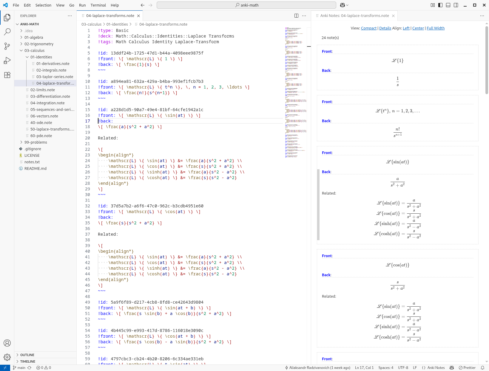

# Tools for Anki Notes

A collection of tools designed for simple and collaborative [Anki](https://apps.ankiweb.net/) note creation.

## Text File Format

The notes are defined in a simple human readable text format, like in the follwing examples.

File `geography.note`:

```
!type: Cloze
!deck: Geography
!tags: Geography Capital

!text: The capital of {{c1::Mongolia::country}} is {{c2::Ulaanbaatar::city}}.
~~~

!text: The capital of {{c1::Syria::country}} is {{c2::Damascus::city}}.
~~~
```

File `math.note`:

```
!type: Basic
!deck: Math
!tags: Math Equation

!front: Euler's Formula
!back:
$$
\begin{align*}
    e^{ix}  &= \cos x + i \sin x \\
    e^{-ix} &= \cos x - i \sin x
\end{align*}
$$
~~~

!front: Mean Value Theorem
!back:
The **Mean Value Theorem** states that if a function $f$ is continuous on the closed
interval $[a, b]$ and differentiable on the open interval $(a, b)$, then there exists
at least one $c \in (a, b)$ such that

$$ f'(c) = \frac{f(b) - f(a)}{b - a} $$
~~~
```

## Command Line Tools

The tool `anotes` scans the given directory for all `*.note` files and compiles them into an output deck that can be
imported into Anki.

```shell
$ npm install -g @anotes/cli
$ anotes export --dir=notes --out=notes.txt
```

## Visual Studio Code Extension

The Visual Studio Code extension makes it easier to edit note files by providing syntax highlighting and note previews.


